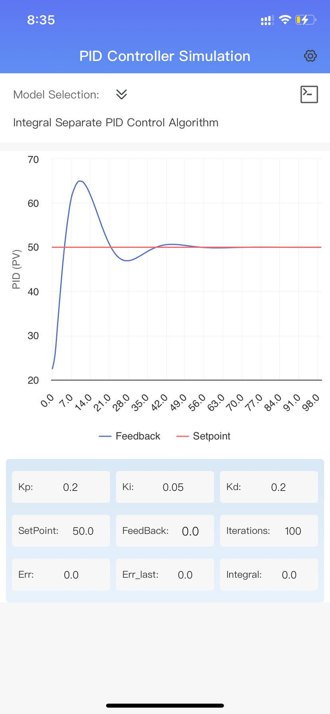

# PIDController
PID Controller Assistant - Master the Core of Automatic Control
This app is your powerful ally in learning and applying PID control! Whether you're an engineering student, automation enthusiast, or professional engineer, you'll benefit from this tool.
Key Features:

Clear and concise explanations of core PID control concepts
Interactive demonstrations to help you understand PID parameter effects
Practical PID tuning guides and tips
Simulation support for single-loop systems

Learning Content Includes:

Relationships between controlled variable, setpoint, and control output
Functions and adjustment methods of P, I, and D terms
Differences between direct and reverse acting control
Concepts of dynamic and static errors
Basic methods for PID parameter tuning

Special Functions:

Visualization of PID response curves
Parameter sensitivity analysis tools
Case library of common PID application scenarios
This project supports the following PID control algorithms:

    The Positional PID Control Algorithm
    The Incremental PID Control Algorithm
    The Integral Separate PID Control Algorithm
    The Integral Saturation PID Control Algorithm
    The Gearshift Integral PID Control Algorithm
    The PID Control Algorithm with Filter
    The Incomplete Differential PID Control Algorithm
    The Derivative Ahead PID Control Algorithm
    The PID Control Algorithm with Dead Zone
Whether you want to improve work efficiency or prepare for exams, this app will help you easily master the essentials of PID control.

Support or Contact

qqGroup: 820594265

Email: supportsw365@163.com

